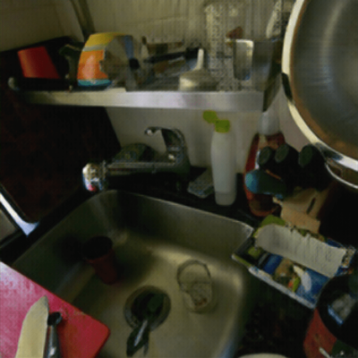

# Super resolution project

[][license]
[][read the docs]
[][black]
[][pre-commit]

[read the docs]: https://super-resolution.readthedocs.io
[pre-commit]: https://github.com/pre-commit/pre-commit
[black]: https://github.com/psf/black
[license]: https://github.com/sing-lab/super-resolution/blob/master/LICENSE.rst

# Table of contents

[**Preamble**](https://github.com/sing-lab/super-resolution#1-preamble)

[**Installation**](https://github.com/sing-lab/super-resolution#installation)

[**Demo app**](https://github.com/sing-lab/super-resolution#demo-app)

[**Train, test or predict with the full project**](https://github.com/sing-lab/super-resolution#train-test-or-predict-with-the-full-project)

[**Performances**](https://github.com/sing-lab/super-resolution#performances)

[**Differences with SRGAN paper**](https://github.com/sing-lab/super-resolution#differences-with-srgan-paper)

# Preamble
This repo is the python implementation of [Photo-Realistic Single Image Super-Resolution Using a Generative Adversarial Network](https://arxiv.org/abs/1609.04802).

SRGAN assumes an ideal **bicubic down-sampling kernel**, which is different from real degradations. Other models such as
[ESRGAN: Enhanced Super-Resolution Generative Adversarial Networks](https://arxiv.org/abs/1809.00219) or [Real-ESRGAN: Training Real-World Blind Super-Resolution with Pure Synthetic Data](https://arxiv.org/abs/2107.10833) use
different degradations to improve super resolution performances.

SRRESNET is trained using only the MSE loss. However, the MSE is not able to deal with high frequency content in the image, that resulted in producing overly smooth images.
Therefore, the authors of the paper decided to use loss of different VGG layers. This VGG loss is based on the ReLU activation layers of the pre-trained 19 layer VGG network.

SRGAN generator loss is made of the **perceptual loss** which is a weighted sum of the MSE and VGG loss, and of the generator **adversarial loss**.
SRGAN discriminator loss is only the **adversarial loss**.

# Installation

1. Clone the projet

2. Download trained models from [here](https://drive.google.com/drive/folders/160z6A1eE5ye-JjZcOljNUUA-1o95xTg3?usp=sharing)
and add them into:
   - **[models/SRGAN](models/SRGAN)** folder for the SRGAN generator (`generator_epoch_28.torch`)
   - **[models/SRRESNET](models/SRRESNET)** folder for the SRResnet pretrained generator (`generator_epoch_204.torch`)

3. Project requirements can be installed with `poetry install`

# Demo app
You can run the project demo locally or using docker.

1. In a **container** with `docker-compose run --service-ports --rm app` (in the project root), then access the demo app [here](http://localhost:8000).

2. **Locally** with `poetry run streamlit run api/app/main.py`

Notes:
- To use GPU, NVIDIA cuda driver must be installed.
- Predict the whole image in one run may lead to out of memory for big images. Prediction is then made **tile by tile**.
- In a container, the url shown in the terminal won't work as it is relative to the Docker container it’s running in.

# Train, test or predict with the full project

This repo can be used to train, predict or test a model, using the correct **configuration file**: create your configuration file in the [configs](configs) folder, or use one of the existing config file.

## Download dataset

On the SRGAN papers, authors used 300K images from ImageNET dataset. However, is it easier to download the [COCO2017](https://cocodataset.org/#download) dataset.
You need to download the dataset and put in under folders defined in the config files.
Dataset is from :
  - 40.7K test images
  - 118K train images
  - 123K unlabeled images
  - 5000 val images

We use both train, unlabeled, and test split to train the model, and use another test set to get performances.
Therefore, the train set is made of 282K images and the validation set of 5K images.

**Linux / WSL**:
- Run `sudo apt-get install unzip`
- Run `sh get_dataset.sh` in the terminal to automatically download and extract dataset in the folders defined in
default configs files.

**Windows**:
- Download each split: [eval](http://images.cocodataset.org/zips/val2017.zip) [train](http://images.cocodataset.org/zips/train2017.zip) [test](http://images.cocodataset.org/zips/test2017.zip) [unlabeled](http://images.cocodataset.org/zips/unlabeled2017.zip)
- Extract `train2017.zip`, `unlabeled2017.zip` `test2017.zip` into `data/raw/train`
- Extract `val2017.zip` into `data/raw/val`
- Download from the [drive](https://drive.google.com/drive/folders/1ZVvIzbXdx5wmSs5QY74RNMY0Rx--yYUI?usp=share_link) the test images
- Extract the `test` folder into `data/raw/test`

## Run the project
You can run the project locally or using docker.

1. In a **container** with `docker-compose run main "$config_path"` (in the project root).

2. **Locally** with `poetry run super_resolution $config_path`

Examples:
1. To train a model:

`docker-compose run --rm main configs/SRGAN/srgan_train_config.yml`

`poetry run super_resolution configs/SRGAN/srgan_train_config.yml`

After the training completed, you can find:
- logs at `logs/SRGAN/$EXPERIMENT_NAME`
- models at `models/SRGAN/$EXPERIMENT_NAME`
- images at `data/processed/val/SRGAN/$EXPERIMENT_NAME`

Or in the directory specified in the `config_file` you used.

Training can be then monitored with:
`poetry run tensorboard --logdir logs/$EXPERIMENT_NAME`

2. To test a model and get performances:

`docker-compose run --rm main configs/SRGAN/srgan_test_config.yml`

`poetry run super_resolution configs/SRGAN/srgan_test_config.yml`

- Test data must exist in the location specified in the config file.
- Predicted data will be saved in the location specified in the config file.
- Average PSNR and SSIM for each folder are then displayed in the terminal.

3. To super-resolve images using a model:

`docker-compose run --rm main configs/SRGAN/srgan_predict_config.yml`

`poetry run super_resolution configs/SRGAN/srgan_predict_config.yml`

- Input data must exist in the location specified in the config file.
- Predicted data will be saved in the location specified in the config file.

Prediction can be done tile by tile to adapt to smaller GPU, cf [srgan_predict_config](configs/SRGAN/srgan_predict_config.yml)

# Performances

**SRRESNET** model was trained on 204 epochs.

**SRGAN** was trained on 30 epochs. After 15 epoch, the learning rate was divided by 10.
Epoch 29 gives the best results (around 250 000 iterations), based on empirical analysis of super resolved validation images at each epoch.

Hyperparameters used to trained models are the same as the ones in the default configuration files.
- `jpeg_compression` was not used for SRGAN training (cf Preamble section) as generator struggle to recover lost information. Empirically, it gave
worst results (for SRGAN: PSNR ~ 23, SSIM ~ 0.60).
- SRGAN perceptual loss `0.1*0.001*VGG_loss + 0.9*MSE` (cf Loss section).

SRGAN checkpoint is [available](https://drive.google.com/drive/folders/160z6A1eE5ye-JjZcOljNUUA-1o95xTg3?usp=sharing) to resume training for SRGAN. To use it, download it and add its path in the srgan training configuration file.
In addition, training logs for SRGAN are available (compatible with tensorboard).

## Results
Here are the results (with the paper's results in parantheses):

|              |     PSNR      |      SSIM      ||     PSNR      |      SSIM      ||     PSNR      |      SSIM      |
|:------------:|:-------------:|:--------------:|:-------------:|:--------------:|:-------------:|:--------------:|:---:|:---:|
| **SRResNet** | 31.40 (32.05) | 0.895 (0.9019) || 27.98 (28.49) | 0.782 (0.8184) || 27.01 (27.58) | 0.741 (0.7620) |
|  **SRGAN**   | 30.64 (29.40) | 0.870 (0.8472) || 26.91 (26.02) | 0.741 (0.7397) || 25.91 (25.16) | 0.692 (0.6688) |
|              |   **Set5**    |    **Set5**    ||   **Set14**   |   **Set14**    ||  **BSD100**   |   **BSD100**   |

## Illustrations

From left to right: low resolution, srresnet prediction, srgan prediction, original high resolution image.

## SRGAN training logs

# Differences with SRGAN paper

1. Low resolution image: in addition to the SRGAN bicubic interpolation when processing high resolution to low resolution images, we added:
   - Random JPEG compression
   - Random horizontal or vertical flip

  However, as stated in [A Hybrid Approach Between Adversarial Generative Networks and Actor-Critic
  Policy Gradient for Low Rate High-Resolution Image Compression](https://arxiv.org/abs/1906.04681) article, when using jpeg compression on low resolution images, the
  drastic down-sampling of JPEG image causes loss of information, difficult to recover from the super resolution network,
  which leads to lower results in PSNR. It was then only used for experimentation but is available in the configuration files.

2. High resolution image size: we use a size of 128x128 to train the model as it gives better result than 96x96.

3. Dataset: we use images from [COCO2017](https://cocodataset.org/#home) dataset as they are easier to get than the ImageNET dataset.

4. Artifacts: pixel shuffle layer may produce **checkerboard artifacts**. A better initialisation of convolutional layer kernel help reduce these
artifacts. To remove unpleasant checkerboard artifacts from reconstructed images, we used ICNR initialisation for the
subpixel convolutional block, see [this article](https://arxiv.org/abs/1707.02937).

5. Loss: our SRGAN loss contains both MSE and VGG loss where in the paper only the VGG loss is used. Using the MSE
allows better reconstructed images: contrast is better, colour are not shifting, and **batch normalization artifacts** are removed. Note that batch
normalization artifacts occurred during experiments for `0.9*MSE + 0.1*0.006*VGG_loss`, but were not present for
`0.9*MSE + 0.1*0.001*VGG_loss`. Therefore, VGG loss coefficient was set to `0.1 * 0.001`. Weights for MSE and VGG in the perceptual loss
are also inspired from [Weighted SRGAN and Reconstruction Loss Analysis for Accurate Image Super Resolution](https://iopscience.iop.org/article/10.1088/1742-6596/1903/1/012050/pdf).

| *Checkerboard artifacts when no MSE loss is used on the perceptual loss* | *Batch normalization artifacts with VGG loss coefficient of 0.1\*0.006, explanations on [ESRGAN paper](https://arxiv.org/pdf/1809.00219.pdf)* |
|:------------------------------------------------------------------------:|:---------------------------------------------------------------------------------------------------------------------------------------------:|
|    | 

# Contributing

Contributions are very welcome.
To learn more, see the `Contributor Guide`.

# License

Distributed under the terms of the `MIT license`,
_super_resolution_ is free and open source software.

# Issues

If you encounter any problems,
please `file an issue` along with a detailed description.

# Credits

This project was generated from `@cjolowicz's` `Hypermodern Python Cookiecutter` template.
This repo is inspired from the following GitHub repo [a-PyTorch-Tutorial-to-Super-Resolution](https://github.com/sgrvinod/a-PyTorch-Tutorial-to-Super-Resolution).
